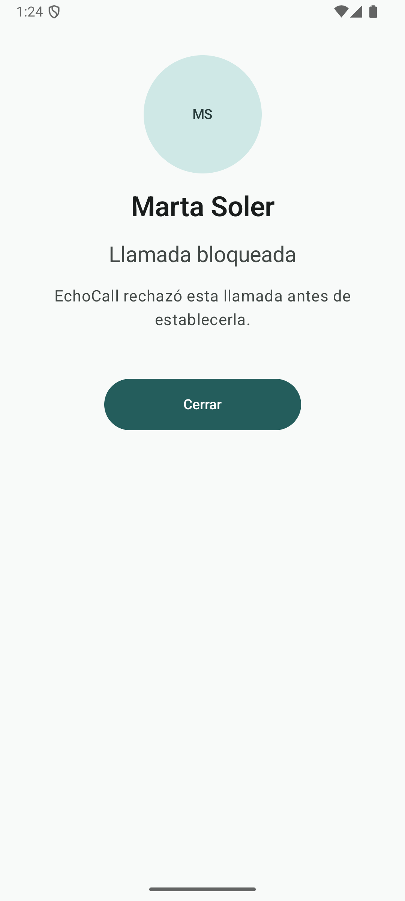
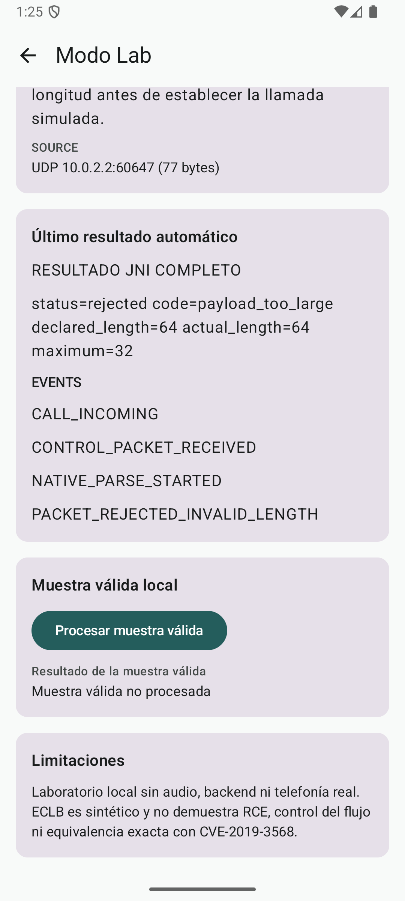

# Resultados experimentales

La comparación final aplicó la misma entrada a las variantes Patched y
Vulnerable construidas con instrumentación AddressSanitizer. `Patched ASan` y
`Vulnerable ASan` significan variante de parser + build instrumentado; ASan no
es otra implementación lógica.

## Entrada común

| Propiedad | Valor |
|---|---|
| Archivo | `samples/malformed/oversized_complete_payload.bin` |
| Tamaño total | 77 bytes |
| Cabecera | 13 bytes |
| `declared_length` | 64 |
| `actual_length` | 64 |
| Máximo Patched | 32 |
| SHA-256 | `516F7C6A9B6237274F33F8AB01057DFDBD1137DF0C898F70B5AFB6B7DA742ABA` |

La longitud declarada coincide con la real. Así se supera la comprobación de
coherencia de Vulnerable y se alcanza la diferencia relevante: validar o no el
máximo de 32 antes de procesar el payload.

## Observación comparada

| Propiedad | Patched + ASan | Vulnerable + ASan |
|---|---|---|
| Parser | `safe_parse_packet` | `vulnerable_parse_packet` |
| Decisión | Rechazo antes del procesamiento | Copia gobernada por `declared_length` |
| Resultado | `payload_too_large` | `heap-buffer-overflow` |
| Operación | No alcanza el sink | `WRITE` de 64 bytes mediante `__asan_memcpy` |
| Región | No aplica | Heap de 32 bytes |
| Proceso | Permaneció vivo | Terminó mediante `SIGABRT` |
| ASan | Sin informe observado en la ventana documentada | Informe y `ABORTING` |

Patched devolvió literalmente:

```text
status=rejected code=payload_too_large declared_length=64 actual_length=64 maximum=32
```

### Complemento visual actual de Patched

<p align="center">
  
</p>

<p align="center"><em>La variante Patched bloquea la llamada simulada después de rechazar automáticamente el paquete por una longitud no permitida.</em></p>

La pantalla muestra el resultado visible para la persona usuaria. Por sí sola
no demuestra la recepción UDP, la ejecución del parser ni la cadena
experimental.

<p align="center">
  
</p>

<p align="center"><em>Resultado técnico de Patched: la longitud declarada de 64 bytes supera el máximo semántico de 32 y la entrada se rechaza antes de la copia.</em></p>

Ambas capturas son demostraciones actuales y complementarias. C04 no procede
de la ejecución histórica E-025 ni reemplaza sus metadatos, sender, log y
estados UI primarios; documenta el mismo contrato de rechazo
`payload_too_large` en la interfaz vigente.

Vulnerable alcanzó la copia y ASan atribuyó la escritura a
`vulnerable_parse_packet`. La ejecución oversized Vulnerable fue única y no se
incluye en CI, quickstarts ni demostraciones rutinarias.

## Qué sabemos y cómo lo sabemos

| Afirmación | Evidencia |
|---|---|
| Patched valida antes del payload | Código `safe_parser.c`, CTest y reversing E-029 |
| Vulnerable reserva 32 y copia la longitud declarada | Código `vulnerable_parser.c` y reversing E-028 |
| Patched rechazó la entrada final | Log/resultados Android y proceso vivo |
| Vulnerable escribió 64 sobre una región de 32 | Informe ASan, log RAW, tombstone y simbolización |
| La operación no retornó normalmente | Ausencia de limpieza del marcador, terminación y `SIGABRT` |
| Ambos resultados usaron candidatos fijados | Tamaños, SHA-256 y manifiestos de procedencia |

La [procedencia completa](evidence/android-experiment-provenance.md)
relaciona commit fuente, APK, hashes y custodia. El
[registro experimental](evidence/experimental-validation-log.md)
separa evidencia primaria, reportada e histórica.

## Interpretación

**Hecho confirmado:** la entrada coherente de 64 bytes alcanzó una escritura
fuera de los límites de una reserva heap de 32 bytes en el parser Vulnerable de
EchoCall.

**Hecho confirmado:** Patched rechazó esa misma condición mediante el máximo
semántico de 32 y el proceso permaneció vivo en la ejecución documentada.

**Interpretación:** el contraste muestra por qué la validación debe preceder a
una operación cuyo tamaño depende de datos externos.

**Limitación:** no se demostró RCE, control del flujo, compromiso completo,
seguridad general de Patched ni equivalencia exacta con CVE-2019-3568. Consulta
[`limitations.md`](limitations.md).
