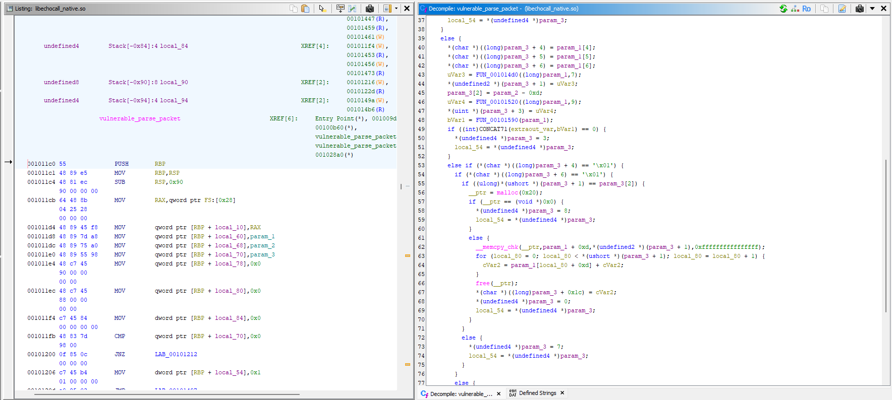
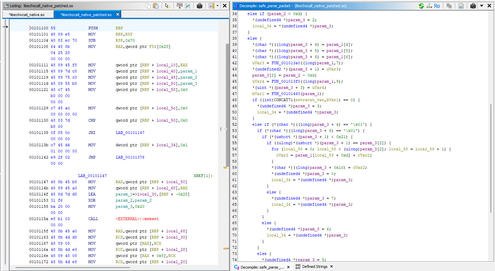

# Reversing estático: Vulnerable y Patched

E-028 y E-029 conservan el análisis Ghidra de dos bibliotecas x86_64 de
EchoCall. La comparación muestra una convergencia de evidencia estática y
dinámica sobre la lógica del laboratorio, no una correlación
instrucción-a-instrucción con los APK ASan finales.

El reversing responde a una pregunta distinta de la ejecución instrumentada:
¿qué decisiones de control de flujo y qué operaciones de memoria pueden
reconstruirse desde el binario? Las capturas permiten seguir JNI hasta cada
parser y contrastar la presencia de la reserva/copia Vulnerable con la
validación Patched.

## Vulnerable — E-028

El flujo recuperado fue:

```text
NativeBridge.parsePacket(byte[])
  → Java_com_echocall_lab_NativeBridge_parsePacket
  → vulnerable_parse_packet
  → declared_length == actual_length
  → malloc(32)
  → copy(declared_length)
```

Antes del sink no se identificó un límite equivalente a
`declared_length <= 32`. Una entrada coherente mayor que la reserva puede, por
tanto, alcanzar una copia cuyo tamaño supera el destino. La condición es
compatible con CWE-122.

- Identidad ELF registrada: `A14467B2377A73FAEB83143564269E0E16D6494047F89C30819921B76BF26723`.
- Tamaño registrado: 8.360 bytes.
- Evidencia: [README y capturas E-028](evidence/artifacts/E-028/README.md).

## Patched — E-029

El flujo recuperado fue:

```text
NativeBridge.parsePacket(byte[])
  → Java_com_echocall_lab_NativeBridge_parsePacket
  → safe_parse_packet
  → declared_length < 0x21   # máximo 32
      ├─ no → status = 6 → payload_too_large
      └─ sí → declared_length == actual_length → procesamiento
```

Dentro de `safe_parse_packet` no se observó la secuencia
`malloc(32) → copy(declared_length)` de E-028.

- Identidad ELF registrada: `229C26DBEB9110B22ED08F75B2A4F171900412389D7440B506EC5E9301507D60`.
- Tamaño registrado: 7.984 bytes.
- Evidencia: [README y capturas E-029](evidence/artifacts/E-029/README.md).

## Comparación visual del análisis estático

Las imágenes siguientes se referencian desde sus ubicaciones originales en
E-028 y E-029. No se han movido, renombrado ni duplicado.

### Vulnerable — E-028



*Descompilación del parser vulnerable: reserva fija de 32 bytes y copia gobernada por la longitud declarada sin validar el máximo semántico.*

### Patched — E-029



*Descompilación del parser Patched: comprobación de la longitud declarada frente al máximo permitido antes de realizar la copia.*

## Comparación

| Elemento | Vulnerable | Patched |
|---|---|---|
| JNI público | `NativeBridge.parsePacket()` | `NativeBridge.parsePacket()` |
| Coherencia declared/actual | Sí | Sí |
| Límite de 32 antes del procesamiento | No identificado | Sí, `< 0x21` |
| Reserva/copia crítica | `malloc(32)` + copia gobernada por entrada | No observada en `safe_parse_packet` |
| Oversized | Puede alcanzar el sink | `status=6` → `payload_too_large` |

Esta diferencia estática es coherente con el resultado dinámico: ASan observó
una escritura de 64 bytes sobre una región heap de 32 bytes en Vulnerable,
mientras Patched rechazó esa misma entrada y mantuvo el proceso vivo.

## Limitación de custodia

Los ELF exactos correspondientes a los dos SHA-256 registrados no se han
localizado en el checkout auditado. Las capturas y los README están
preservados, pero no se sustituyen los binarios por `.so` locales de igual
tamaño o función. Tampoco se afirma que los ELF de Ghidra sean idénticos a los
usados en las ejecuciones ASan 8A/8B.

El análisis no demuestra una ejecución concreta, control del flujo, ejecución
arbitraria, RCE ni seguridad general de Patched. Esos límites se desarrollan en
[`limitations.md`](limitations.md).
